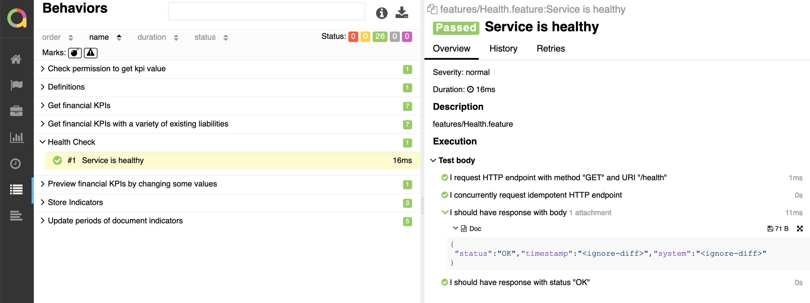

# Allure Formatter

[](https://github.com/godogx/allure/actions?query=branch%3Amaster+workflow%3Atest-unit)
[](https://codecov.io/gh/godogx/allure)
[](https://pkg.go.dev/github.com/godogx/allure)
[](https://wakatime.com/badge/github/godogx/allure)


Stores [`godog`](https://github.com/cucumber/godog) test results in `allure 2` format.

## Usage

[Allure](https://github.com/allure-framework/allure2) is convenient UI to expose test results.

You can enable it by calling `allure.RegisterFormatter()`.

Additional configuration can be added with env vars before test run.

`ALLURE_ENV_*` are added to allure environment report.

`ALLURE_EXECUTOR_*` configure `Executor` info.

`ALLURE_RESULTS_PATH` can change default `./allure-results` destination.

Example:
```bash
export ALLURE_ENV_TICKET=JIRA-1234
export ALLURE_ENV_APP=todo-list
export ALLURE_EXECUTOR_NAME=IntegrationTest
export ALLURE_EXECUTOR_TYPE=github
export ALLURE_EXECUTOR_URL=https://github.com/
```

Then you can run test with
```bash
# Optionally clean up current result (if you have it).
rm -rf ./allure-results/*
# Optionally copy history from previous report.
cp -r ./allure-report/history ./allure-results/history
# Run suite with godog CLI tool or with go test.
godog -f allure
# Generate report with allure CLI tool.
allure generate --clean
```

## Sample report

